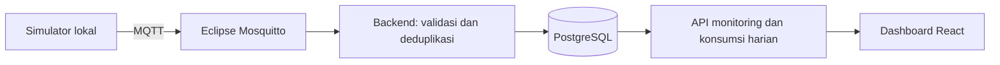

# SmartBilling — Capstone A05

SmartBilling adalah aplikasi web untuk memantau penggunaan listrik kamar kost dan fasilitas bersama, sekaligus menjadi dasar sistem pembagian biaya listrik berbasis pemakaian. Aplikasi dirancang untuk membantu pemilik dan penghuni memahami konsumsi melalui pembacaan meter, grafik historis, dan ringkasan energi harian.

Proyek ini dikembangkan sebagai Capstone A05. Sudah tersedia **monitoring lokal, autentikasi owner/tenant dan sesi RFID simulasi**, dari MQTT ke PostgreSQL hingga dashboard web. Integrasi ESP32 dan perhitungan tagihan belum diimplementasikan.

## Fitur yang tersedia

- **Dashboard monitoring:** pilihan kamar dan meter, tegangan, arus, daya, counter energi kumulatif, serta waktu pembacaan terakhir.
- **Histori penggunaan:** grafik daya dengan filter tanggal dan pilihan tujuh hari, serta tabel konsumsi energi harian.
- **Informasi kualitas data:** penanda pembacaan lama, data lengkap atau parsial, kondisi tanpa data, dan gangguan koneksi.
- **Pembaruan otomatis:** polling status backend dan pembacaan terbaru setiap lima detik ketika tab aktif.
- **Penerimaan MQTT:** validasi pesan, pemetaan perangkat ke meter, deduplikasi, serta pencatatan pesan invalid atau konflik.
- **Penyimpanan persisten:** pembacaan tersimpan di PostgreSQL dan dapat diakses kembali setelah layanan dimulai ulang.
- **Simulator pengembangan:** dataset deterministik serta simulator berkala **Simulasi berjalan** pada meter terpisah. Pengiriman ulang tidak menambah pembacaan ganda; counter berkala bertahan setelah restart.
- **Sesi fasilitas RFID:** tap pertama membuka dan tap berikutnya kartu sama menutup sesi; riwayat owner, scope peserta untuk API tenant, replay aman, energi nullable dihitung backend. Fasilitas/meter simulator terpisah dari dataset monitoring.

Dashboard memuat data dari API backend. Data simulasi diberi label; keberhasilan refresh browser tidak berarti sensor mengirim pembacaan baru.

## Alur aplikasi

Simulator berkala dapat dijalankan secara eksplisit setelah migration untuk memeriksa pembaruan dashboard dari data baru:

```powershell
.\scripts\docker.ps1 compose --profile simulation run --rm -d --no-deps --name smartbilling-simulator simulator
# Menghentikan sebelum selesai:
.\scripts\docker.ps1 stop --timeout 15 smartbilling-simulator
```

Pilih **Simulasi berjalan** di http://127.0.0.1:3000. Default lima sampel, interval 60 detik, polling dashboard lima detik. Counter/checkpoint bertahan setelah restart; dataset deterministik tidak diubah. Simulator tidak dijalankan saat startup aplikasi. Detail migration, model beban virtual, restart dan verifikasi ada di [pengembangan lokal](docs/LOCAL-DEVELOPMENT.md#simulator-berkala-simulasi-berjalan).



Alur di atas sudah tersedia untuk simulasi lokal. ESP32 nantinya menjadi sumber pembacaan setelah kontrak firmware dan koneksi broker diselaraskan. Browser mengambil data melalui API; perhitungan konsumsi dilakukan di backend.

## Prinsip pengolahan data

- Nilai kWh dari meter adalah **counter kumulatif**. Konsumsi dihitung dari selisih counter yang valid, bukan penjumlahan seluruh pembacaan.
- Data yang hilang tidak dianggap sebagai konsumsi nol. Hari dengan batas pembacaan tidak lengkap, gap, atau reset dapat menghasilkan total tidak tersedia dan subtotal interval valid.
- Batas hari mengikuti zona waktu bangunan; konfigurasi demo menggunakan Asia/Jakarta.
- Tujuh hari adalah target pengamatan dan pilihan rentang histori, **bukan batas penyimpanan atau jadwal penghapusan otomatis**.

## Teknologi

| Bagian | Teknologi |
| --- | --- |
| Frontend | React, Vite, Recharts, CSS |
| Backend | Node.js, Express, JavaScript |
| Database | PostgreSQL dengan driver `pg`, tanpa ORM |
| Komunikasi | MQTT.js dan Eclipse Mosquitto |
| Lingkungan lokal | Docker Compose |
| Target deployment | Railway — belum diterapkan |

Hasil build frontend disajikan oleh Express bersama API pada satu alamat lokal.

## Menjalankan secara lokal

Siapkan Node.js 22.20 atau lebih baru dalam seri 22, npm, dan Docker Desktop dengan Linux Engine aktif. Jalankan perintah PowerShell berikut dari root repository.

### Instalasi pertama

```powershell
npm run init:local
.\scripts\docker.ps1 compose config --quiet
.\scripts\docker.ps1 compose build
.\scripts\docker.ps1 compose up -d --wait postgres mqtt
.\scripts\docker.ps1 compose run --rm --no-deps backend npm run migrate
.\scripts\docker.ps1 compose up -d --wait --wait-timeout 120
.\scripts\docker.ps1 compose exec -T backend npm run seed:demo
```

Inisialisasi membuat konfigurasi lokal dan secret jika belum tersedia. Jangan masukkan `.env` atau `.local/` ke Git. Seed menyediakan mapping demo satu kamar dan tiga meter, tanpa pembacaan sensor atau akun login yang bisa digunakan.

### Menambahkan dataset simulasi

```powershell
.\scripts\docker.ps1 compose exec -T backend node scripts/simulate.js 2026-09-12
```

Buka **[dashboard SmartBilling](http://127.0.0.1:3000)**, pilih meter kamar, lalu klik **Dataset 12 Sep**. Dataset ini menghasilkan 1.441 pembacaan termasuk batas akhir hari, dengan konsumsi harian 1,44 kWh. Meter utama dan komunal belum diberi pembacaan oleh simulator ini.

Dataset historis dikirim sebagai batch; ini belum merupakan simulator yang terus mengirim pengukuran baru. Status **Pembacaan lama** tetap benar meskipun backend terhubung.

### Menjalankan kembali dan menghentikan

```powershell
# Jalankan layanan yang sudah disiapkan
.\scripts\docker.ps1 compose up -d --wait

# Build ulang setelah perubahan kode
.\scripts\docker.ps1 compose up -d --build --wait --wait-timeout 120

# Hentikan layanan tanpa menghapus data
.\scripts\docker.ps1 compose stop
```

Konfigurasi saat ini hanya memublikasikan aplikasi pada localhost. PostgreSQL dan MQTT berada di jaringan internal Docker. Petunjuk konfigurasi, migrasi, dan pemecahan masalah tersedia di [panduan pengembangan lokal](docs/LOCAL-DEVELOPMENT.md).

## Pengujian

```powershell
# Koneksi backend, MQTT, dan PostgreSQL
.\scripts\docker.ps1 compose exec -T backend npm run smoke

# Suite pengujian termasuk PostgreSQL nyata
.\scripts\docker.ps1 compose exec -T -e INTEGRATION_DB=1 backend npm test

# Verifikasi dataset existing tanpa mengirim pesan baru
.\scripts\docker.ps1 compose exec -T backend node scripts/simulate.js 2026-09-12 --verify-only
```

Verifikasi 15 September 2026 mencakup 16 test lulus tanpa skip dengan PostgreSQL nyata serta pembaruan nilai dan histori dashboard otomatis dari simulator berkala. Layanan existing yang sehat dapat langsung dipakai tanpa mengulang build atau seed. Rincian bukti, pemeriksaan persistensi sebelumnya, serta keterbatasan pengujian ada di [HANDOFF](docs/HANDOFF.md).

## Arah pengembangan

- Integrasi sensor ESP32 dengan kontrak MQTT firmware yang disepakati.
- Login dan pembatasan akses pemilik/penghuni pada API.
- Pencatatan penggunaan fasilitas bersama melalui RFID: tap awal memulai sesi, tap berikutnya mengakhirinya.
- Perhitungan dan pembagian biaya di backend sesuai kebijakan yang disepakati tim.
- Perbandingan konsumsi antarkamar dan antarperiode.
- Deployment Railway serta pengamatan perangkat nyata selama tujuh hari.

Login owner/tenant dan sesi RFID simulasi sudah tersedia. Versi saat ini tetap untuk pengembangan lokal; autentikasi ini bukan kesiapan deployment publik.

## Mencoba sesi RFID

Frontend owner dan tenant tersedia di [dashboard lokal](http://127.0.0.1:3000) melalui **Riwayat fasilitas RFID**. Daftar fasilitas mengikuti hak akses API; histori tenant hanya sesi sendiri. Filter tanggal WIB, status, pagination dan alasan energi tersedia dengan layout desktop/ponsel. Untuk melihat data existing tidak perlu menjalankan simulator. [Petunjuk frontend dan hasil uji](docs/FRONTEND-RFID.md).

Dengan layanan existing sehat dan akun tenant demo aktif:

```powershell
.\scripts\docker.ps1 compose exec -T backend node scripts/provision-rfid.js
.\scripts\docker.ps1 compose run --rm -d --no-deps --name smartbilling-rfid-simulator backend node scripts/simulate-rfid.js demo
# Opsional: hentikan sebelum selesai; sesi tidak ditutup otomatis.
.\scripts\docker.ps1 stop --timeout 15 smartbilling-rfid-simulator
```

Login owner di [dashboard lokal](http://127.0.0.1:3000), pilih **Riwayat fasilitas RFID** → **Fasilitas RFID — Simulasi**. Demo selesai sendiri setelah dua tap dan tiga pembacaan berjarak 60 detik. Jika berhenti saat sesi aktif, kirim satu tap eksplisit untuk menutup:

```powershell
.\scripts\docker.ps1 compose run --rm --no-deps backend node scripts/simulate-rfid.js tap
```

Jika ada pending, run pertama hanya memulihkan pending; baca output sebelum mengirim aksi baru. [Panduan lengkap, migration, API dan pengujian](docs/LOCAL-DEVELOPMENT.md#simulasi-sesi-rfid). Tidak mengklaim kompatibilitas hardware RFID/ESP32.

## Struktur repository

```text
web/                 Dashboard React dan helper tampilan
src/                 Backend, API, validasi, dan ingest MQTT
migrations/          Migrasi skema PostgreSQL
scripts/             Inisialisasi, seed, simulator, dan verifikasi
test/                Pengujian backend dan helper dashboard
docker/              Konfigurasi broker MQTT
docs/                Spesifikasi, arsitektur, ERD, dan panduan
```

## Dokumentasi

- [Kebutuhan produk](docs/PRD.md)
- [Arsitektur sistem](docs/ARCHITECTURE.md)
- [ERD dan rancangan database](docs/database/cpstn-erd-final.md)
- [API monitoring](docs/API-MONITORING.md)
- [Kontrak MQTT simulasi](docs/MQTT-CONTRACT.md)
- [Kontrak dan rancangan RFID simulasi v1](docs/RFID-SIMULATION-PLAN.md)
- [Rancangan dashboard](docs/DASHBOARD-PLAN.md)
- [Panduan pengembangan lokal](docs/LOCAL-DEVELOPMENT.md)
- [Status implementasi dan hasil pengujian](docs/HANDOFF.md)
