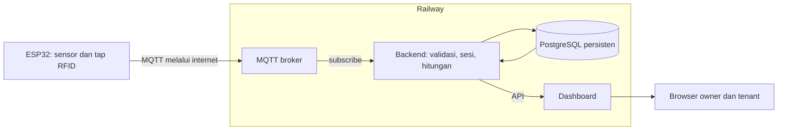

# Arsitektur kerja Capstone A05

Versi handoff, 9 September 2026; catatan lingkungan diperbarui 10 September 2026. Ini adalah arah sistem. Repository aktif `C:\Users\Admin\source\repos\SmartBilling` telah diaudit; persiapan lokal dijelaskan di `LOCAL-DEVELOPMENT.md`, hasil uji nyata di `HANDOFF.md`.

## Alur data

Railway adalah tempat menjalankan layanan. ESP32 menghubungi hostname/port publik broker, bukan URL HTTP dashboard. Backend subscribe broker dan menulis data ke database. Browser mendapat data lewat backend.

## Baseline komponen

| Komponen | Arah |
|---|---|
| Backend | Persiapan minimum disetujui: Node.js/Express, JavaScript, driver `pg` tanpa ORM, MQTT.js. |
| Database | PostgreSQL, mengacu ERD v1 dengan migration yang diperiksa. |
| Frontend | Belum dipilih; periksa repository dan pertahankan pilihan yang layak. |
| Broker MQTT | Eclipse Mosquitto disetujui untuk pengujian lokal. |
| Lokal | Docker Compose dapat menjalankan broker, backend/web dan database. |
| Online | Setiap komponen Compose dipetakan ke service Railway; bukan menjalankan Compose langsung di platform. |

Untuk prototipe, API dan subscriber boleh satu proses backend dengan lifecycle/reconnect yang benar. Frontend boleh dilayani backend atau service terpisah sesuai stack existing. Gunakan satu replica subscriber awal; scaling memerlukan strategi konsumen dan deduplikasi yang diuji.

## Batas modul backend

- **MQTT adapter/inbox:** decode dan validasi pesan, mapping perangkat, deduplikasi, status pemrosesan.
- **Monitoring service:** persist sampel, last seen, query histori dan agregasi rentang.
- **Session service:** tap-to-tap, mapping kartu/penghuni/fasilitas, pembacaan batas sesi, histori.
- **Billing service:** menerima data valid dan parameter kebijakan, menghasilkan estimasi/hasil sesuai kelengkapan input.
- **API/auth:** hak akses owner/tenant, filter dan pagination, response data/status yang konsisten.

Handler MQTT tidak menjalankan seluruh logika billing secara ad hoc. Grafik konsumsi tidak menghitung tagihan sendiri di browser.

## Kontrak perangkat

Kontrak final belum diberikan. Periksa firmware/payload existing sebelum membuat kontrak baru. Topik contoh proposal seperti `kost/room/i/monitoring`, `kost/main/monitoring` dan `kost/communal/monitoring` adalah model konseptual, bukan jaminan format firmware sekarang.

Identifikasi informasi minimum: identitas perangkat/meter, waktu ukur, counter kWh beserta satuan, identitas pesan untuk deduplikasi, dan parameter listrik yang tersedia. Untuk event RFID perlu identitas kejadian, fasilitas, kartu dan waktu; pembacaan batas sesi diperlukan untuk menghitung energi dengan benar.

ERD menggunakan boot ID, sequence dan counter epoch. Bila firmware belum mengirimkannya, jangan berpura-pura sudah tersedia. Buat adapter/simulator sementara dan dokumentasikan kebutuhan integrasi; jangan menggunakan waktu tiba server saja sebagai bukti bahwa dua pesan adalah kejadian yang sama.

## Sesi RFID

Keputusan pengguna: tap awal membuka sesi; tap berikutnya menutup sesi. Backend menyimpan perubahan status secara atomik/idempoten. Energi akhir minus awal hanya sah pada counter yang konsisten. Sesi tanpa pembacaan valid ditandai perlu pemeriksaan; jangan otomatis menagih nol atau mengarang energi.

Makna kartu berbeda, multi-peserta dan debounce belum dirinci. Default simulasi boleh satu pengguna; dokumentasikan sebagai default, bukan perubahan permanen ERD. Tap dari pengguna lain tidak boleh diam-diam menutup sesi seseorang.

## Histori tujuh hari

- Simpan data mentah untuk menjaga jejak pengukuran; query agregat dibentuk menurut rentang dan zona waktu bangunan.
- Daya adalah nilai pada waktu tertentu. Energi konsumsi adalah perubahan counter kWh antar batas; keduanya tidak dipertukarkan.
- Counter reset/pergantian meter harus disegmentasi. Gap data ditampilkan sebagai gap/parsial; interpolasi hanya melalui aturan kualitas yang jelas.
- Tujuh hari adalah durasi target eksperimen. Retensi data tidak otomatis tujuh hari; backup/ekspor dapat ditambahkan sesuai kebutuhan tim.
- Simulator membantu menguji histori cepat, tetapi dipisahkan dari database/dataset pengamatan nyata.

## Railway dan Docker

1. Backend dibangun dari Dockerfile atau image. Pisahkan konfigurasi dari source melalui environment variables.
2. Broker menggunakan TCP Proxy publik untuk MQTT TCP. ESP32 memakai domain dan port yang diberikan Railway. Konfigurasi broker dan TLS/authentication harus diperiksa saat implementasi; HTTPS dashboard tidak membuktikan MQTT sudah terenkripsi.
3. Backend ↔ broker/database menggunakan jaringan privat bila berada pada project/environment yang sama.
4. PostgreSQL menggunakan penyimpanan persisten. Broker memakai volume bila persistence sesi/antrian diaktifkan. Persistent volume broker tidak menggantikan tabel histori database.
5. Broker dan subscriber tetap berjalan selama eksperimen; nonaktifkan mode tidur untuk kedua layanan tersebut.
6. Retry startup/reconnect diperlukan karena urutan siapnya database/broker/backend tidak dijamin.
7. Simpan credential nyata di secret/environment platform, bukan berkas dokumentasi atau frontend.

Nama variabel yang dapat dijadikan baseline, disesuaikan kode: `DATABASE_URL`, `MQTT_URL`, `MQTT_USERNAME`, `MQTT_PASSWORD`, `PORT`, `APP_TIMEZONE`, dan secret autentikasi sesuai library. `.env.example` hanya berisi placeholder. Jangan membuat nilai credential atau hostname deployment rekaan sebagai konfigurasi produksi.

Rujukan platform yang diperiksa dalam diskusi: [Docker Compose](https://docs.railway.com/guides/docker-compose), [TCP Proxy](https://docs.railway.com/networking/tcp-proxy), [Private Networking](https://docs.railway.com/networking/private-networking), [PostgreSQL](https://docs.railway.com/databases/postgresql), [Serverless](https://docs.railway.com/deployments/serverless). Verifikasi ulang detail platform ketika benar-benar deploy.
